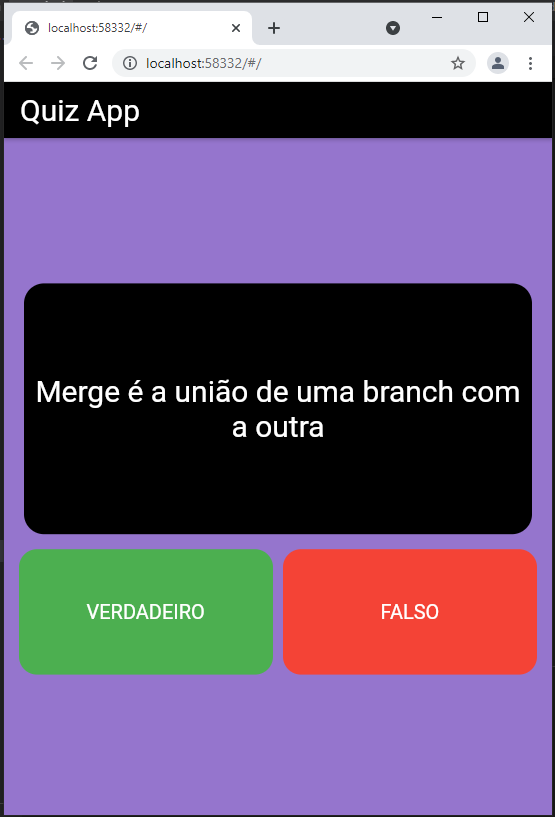
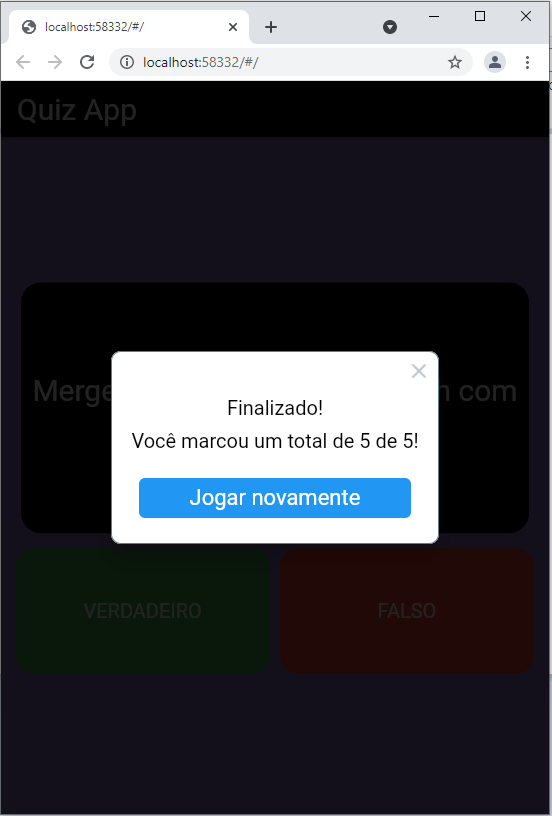

# App Quiz

<h4 align="center"><a href="https://aureasiqueira1.github.io/AppQuiz/#/">Clique para visitar o projeto</a></h4>

[](https://github.com/aureasiqueira1/AppQuiz/actions/workflows/dart.yml)


- [Sobre](#-sobre)
- [Como executar](#-como-executar)
- [Estrutura de arquivos](#-estrutura-de-arquivos)
- [Tecnologias](#-tecnologias)
- [Considerações](#-considerações)


## 💻 Sobre

Este é o nosso projeto do laboratório de Engenharia de software (C214), um pequeno app de quiz feito para aplicar nossos conhecimentos.
<br/>
Consiste em um quiz com 5 perguntas de verdadeiro ou falso que englobam conhecimentos da disciplina de engenharia de software, foi desenvolvido em flutter utilizando o dart como linguagem.
<br/>
A seguir você poderá ver como é a aparencia do nosso app quando rodando na web, utilizando o browser google chrome, uma questão eu o aviso ao concluir o quiz.
<br/>
### 📷 Imagens do aplicativo

<br>

<br>

<br/>

---

## 🚀 Como executar

### Pré-requisitos

Antes de começar, você vai precisar ter instalado em sua máquina as seguintes ferramentas:
<br/>
<br/>
para poder ter o projeto em sua máquina, para que possa executar e fazer alterações, instale o [Git](https://git-scm.com/)
<br/>
recomendamos o [Visual Studio Code](https://code.visualstudio.com/) como editor de texto, ele será útil para obter as dependências e executar o app.
<br/>
baixe a sdk do [Flutter](https://flutter.dev), que nas versões mais novas já vem com o [Dart](https://dart.dev) incluso.


### Clonando repositório

Para clonar o repositório em algum lugar na sua máquina, basta utilizar o comando abaixo:
```bash
$ git clone https://github.com/aureasiqueira1/C214-LAB.git
```

### Instalando dependências da aplicação
Recomendamos utilizar o VisualStudio Code, ao abrir o código dentro dele, baixe as 
extensões do flutter e dart que ele oferece, depois o próprio software oferece
a opção de baixar os pacotes necessários, se ele não oferecer, utilize o seguinte comando no terminal:
```
flutter pub get
```
Uma outra opção é procurar pelo arquivo 'pubspec.yaml' e apertar em "get package".

### Iniciando a aplicação
Para ver a aplicação funcionando, abra o terminal do VsCode e digite o comando
```
flutter run
```
e siga a instrução para escolher seu navegador (recomendamos o Google Chrome)

### Rodando os testes
- Para saber se os testes funcionaram, dentro do terminal use o comando
```sh
flutter test --no-sound-null-safety
```
- Se estiver utlizando o Visual Studio Code, ou outro editor que permita, é possível executar os testes através do próprio arquivo question_test.dart ou widget_test.dart que se encontram na pasta test.

## 📁 Estrutura de arquivos

```
AppQuiz
├─ .git
│  ├─ COMMIT_EDITMSG
│  ├─ config
│  ├─ description
│  ├─ FETCH_HEAD
│  ├─ HEAD
│  ├─ hooks
│  │  ├─ applypatch-msg.sample
│  │  ├─ commit-msg.sample
│  │  ├─ fsmonitor-watchman.sample
│  │  ├─ post-update.sample
│  │  ├─ pre-applypatch.sample
│  │  ├─ pre-commit.sample
│  │  ├─ pre-merge-commit.sample
│  │  ├─ pre-push.sample
│  │  ├─ pre-rebase.sample
│  │  ├─ pre-receive.sample
│  │  ├─ prepare-commit-msg.sample
│  │  ├─ push-to-checkout.sample
│  │  └─ update.sample
│  ├─ index
│  ├─ info
│  │  └─ exclude
│  ├─ logs
│  │  ├─ HEAD
│  │  └─ refs
│  │     ├─ heads
│  │     │  ├─ documentation
│  │     │  └─ master
│  │     └─ remotes
│  │        └─ origin
│  │           ├─ documentation
│  │           └─ HEAD
│  ├─ objects
│  │  ├─ 3b
│  │  │  └─ 1e922c67ec1d978750d7505e921949d5bec191
│  │  ├─ 9b
│  │  │  └─ 132850ffe26915f205bec3d8343913a9581297
│  │  ├─ a7
│  │  │  └─ 2ce33b67afbdc9b40525d364a8e3c223deb743
│  │  ├─ info
│  │  └─ pack
│  │     ├─ pack-faac957da64a1c762b55a2642420770d64f18af9.idx
│  │     └─ pack-faac957da64a1c762b55a2642420770d64f18af9.pack
│  ├─ ORIG_HEAD
│  ├─ packed-refs
│  └─ refs
│     ├─ heads
│     │  ├─ documentation
│     │  └─ master
│     ├─ remotes
│     │  └─ origin
│     │     ├─ documentation
│     │     └─ HEAD
│     └─ tags
├─ .github
│  └─ workflows
│     └─ dart.yml
├─ .gitignore
├─ .metadata
├─ analysis_options.yaml
├─ android
│  ├─ .gitignore
│  ├─ app
│  │  ├─ build.gradle
│  │  └─ src
│  │     ├─ debug
│  │     │  └─ AndroidManifest.xml
│  │     ├─ main
│  │     │  ├─ AndroidManifest.xml
│  │     │  ├─ java
│  │     │  │  └─ io
│  │     │  │     └─ flutter
│  │     │  │        └─ plugins
│  │     │  │           └─ GeneratedPluginRegistrant.java
│  │     │  ├─ kotlin
│  │     │  │  └─ com
│  │     │  │     └─ example
│  │     │  │        └─ projeto
│  │     │  │           └─ MainActivity.kt
│  │     │  └─ res
│  │     │     ├─ drawable
│  │     │     │  └─ launch_background.xml
│  │     │     ├─ drawable-v21
│  │     │     │  └─ launch_background.xml
│  │     │     ├─ mipmap-hdpi
│  │     │     │  └─ ic_launcher.png
│  │     │     ├─ mipmap-mdpi
│  │     │     │  └─ ic_launcher.png
│  │     │     ├─ mipmap-xhdpi
│  │     │     │  └─ ic_launcher.png
│  │     │     ├─ mipmap-xxhdpi
│  │     │     │  └─ ic_launcher.png
│  │     │     ├─ mipmap-xxxhdpi
│  │     │     │  └─ ic_launcher.png
│  │     │     ├─ values
│  │     │     │  └─ styles.xml
│  │     │     └─ values-night
│  │     │        └─ styles.xml
│  │     └─ profile
│  │        └─ AndroidManifest.xml
│  ├─ build.gradle
│  ├─ gradle
│  │  └─ wrapper
│  │     └─ gradle-wrapper.properties
│  ├─ gradle.properties
│  ├─ local.properties
│  └─ settings.gradle
├─ ios
│  ├─ .gitignore
│  ├─ Flutter
│  │  ├─ AppFrameworkInfo.plist
│  │  ├─ Debug.xcconfig
│  │  ├─ flutter_export_environment.sh
│  │  ├─ Generated.xcconfig
│  │  └─ Release.xcconfig
│  ├─ Runner
│  │  ├─ AppDelegate.swift
│  │  ├─ Assets.xcassets
│  │  │  ├─ AppIcon.appiconset
│  │  │  │  ├─ Contents.json
│  │  │  │  ├─ Icon-App-1024x1024@1x.png
│  │  │  │  ├─ Icon-App-20x20@1x.png
│  │  │  │  ├─ Icon-App-20x20@2x.png
│  │  │  │  ├─ Icon-App-20x20@3x.png
│  │  │  │  ├─ Icon-App-29x29@1x.png
│  │  │  │  ├─ Icon-App-29x29@2x.png
│  │  │  │  ├─ Icon-App-29x29@3x.png
│  │  │  │  ├─ Icon-App-40x40@1x.png
│  │  │  │  ├─ Icon-App-40x40@2x.png
│  │  │  │  ├─ Icon-App-40x40@3x.png
│  │  │  │  ├─ Icon-App-60x60@2x.png
│  │  │  │  ├─ Icon-App-60x60@3x.png
│  │  │  │  ├─ Icon-App-76x76@1x.png
│  │  │  │  ├─ Icon-App-76x76@2x.png
│  │  │  │  └─ Icon-App-83.5x83.5@2x.png
│  │  │  └─ LaunchImage.imageset
│  │  │     ├─ Contents.json
│  │  │     ├─ LaunchImage.png
│  │  │     ├─ LaunchImage@2x.png
│  │  │     ├─ LaunchImage@3x.png
│  │  │     └─ README.md
│  │  ├─ Base.lproj
│  │  │  ├─ LaunchScreen.storyboard
│  │  │  └─ Main.storyboard
│  │  ├─ GeneratedPluginRegistrant.h
│  │  ├─ GeneratedPluginRegistrant.m
│  │  ├─ Info.plist
│  │  └─ Runner-Bridging-Header.h
│  ├─ Runner.xcodeproj
│  │  ├─ project.pbxproj
│  │  ├─ project.xcworkspace
│  │  │  ├─ contents.xcworkspacedata
│  │  │  └─ xcshareddata
│  │  │     ├─ IDEWorkspaceChecks.plist
│  │  │     └─ WorkspaceSettings.xcsettings
│  │  └─ xcshareddata
│  │     └─ xcschemes
│  │        └─ Runner.xcscheme
│  └─ Runner.xcworkspace
│     ├─ contents.xcworkspacedata
│     └─ xcshareddata
│        ├─ IDEWorkspaceChecks.plist
│        └─ WorkspaceSettings.xcsettings
├─ lib
│  ├─ main.dart
│  ├─ question.dart
│  └─ quiz_logic.dart
├─ LICENSE
├─ pubspec.lock
├─ pubspec.yaml
├─ README.md
├─ test
│  └─ questions_test.dart
│  └─ widget_test.dart
└─ web
   ├─ favicon.png
   ├─ icons
   │  ├─ Icon-192.png
   │  ├─ Icon-512.png
   │  ├─ Icon-maskable-192.png
   │  └─ Icon-maskable-512.png
   ├─ index.html
   └─ manifest.json

```


## 🛠 Tecnologias

### Ferramentas e Serviços
- [Git](https://git-scm.com/)
- [Flutter](https://flutter.dev/docs/development/tools/vs-code)


### Dependências de desenvolvimento
- [Dart](https://dart.dev/tools/vs-code)
- [Test](https://docs.flutter.dev/testing)
- [Mockito](https://pub.dev/packages/mockito)
- [Flutter Lints](https://pub.dev/packages/flutter_lints)

## 🌱 Considerações

Esse é um projeto simples e inicial, ideal para iniciantes na programação
utilizando flutter.

Alguns recursos que podem ser uteis para você começar o seu projeto:

- [Lab: Write your first Flutter app](https://flutter.dev/docs/get-started/codelab)
- [Cookbook: Useful Flutter samples](https://flutter.dev/docs/cookbook)

Para obter ajuda no inicio com o flutter, visite a
[documentação](https://flutter.dev/docs), que oferece tutoriais,
exemplos, guias no desenvolvimento mobile e todas as referencias sobre API. 
